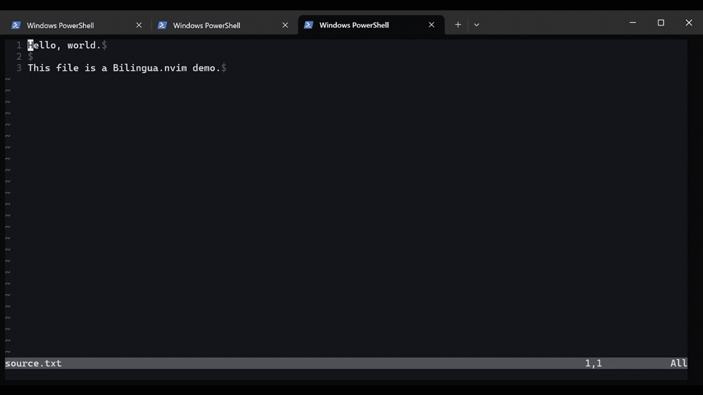

# Bilingua.nvim

Bilingua.nvim は、Neovim で原文（source）と訳文（target、既定は日本語）を並べて編集する利用者が両側の変更を手作業で揃える問題を、Codex CLI の app-server または利用者管理の local llama-server による初期翻訳と双方向同期で解決するプラグインです。

[](https://github.com/popura/bilingua.nvim/actions/workflows/ci.yml)


[](LICENSE)

## デモ

次の例は、英語の `README.md` を日本語の target と並べ、現在位置の編集を同期して Session を終了する最小操作です。backend は翻訳 request の実行先です。Session は、一組の source／target buffer、対応関係、同期 task、backend のライフサイクルを管理する実行単位です。Codex backend を使う場合は、送信する文書内容と利用料金を実行前に確認してください。



```sh
cd /path/to/your/project
nvim README.md
```

Neovim で次を実行します。

```vim
:BilinguaStart en
" source または target の本文を編集する
:BilinguaSync
:BilinguaStop
```

`:BilinguaStart` は target scratch buffer を開いて初期翻訳を開始します。`:BilinguaSync` は cursor 下の対応箇所を同期し、`:BilinguaStop` は source buffer を画面に残して Session の資源を解放します。

## 主な機能

- **双方向同期**: source から target、target から source の両方向へ編集を反映します。
- **構造を考慮した同期**: unit（構文と範囲に基づく最小追跡単位）を抽出し、mapping group（source unit 群と target unit 群の対応集合）ごとに同期します。
- **Plaintext／Markdown 対応**: 段落、見出し、list item、blockquote paragraph を翻訳します。code block、table、数式などは opaque unit（raw text を保持する unit）として扱い、反対側へそのまま複製します。
- **protected token 検証**: URL、inline code、placeholder、link destination などの protected token（翻訳中も原文を保つ literal）を一時 placeholder 化し、model output を完全一致で検証して復元します。
- **手動 conflict 解決**: 両側編集や曖昧な対応を conflict（利用者が正しい側を選ぶ状態）として表示し、source または target を正として同期します。
- **二つの標準 backend**: 既定の Codex app-server と、loopback 上で利用者が運用する local llama-server を選べます。
- **Codex 実行分離**: ephemeral thread、隔離用一時 directory、permission profile、network off、空の environments、tool item の中断を組み合わせます。
- **状態表示と復旧**: sign／virtual text、`:BilinguaStatus`、`:BilinguaRetry`、`:BilinguaRestartBackend` で状態確認と復旧を行います。

## 動作要件

| 項目 | 要件 |
|---|---|
| Neovim | 0.10 以上 |
| Codex backend | Codex CLI 0.146.0 以上、`codex login` で利用可能な認証、text input 対応 model |
| Codex model／reasoning effort | 既定は `gpt-5.6-luna`／`max` |
| llama-server backend | `curl`、外部で起動した llama-server、対応 chat template を持つ instruct model |
| Lua runtime | Neovim 同梱 runtime |
| 外部 Lua dependency | 該当なし |
| README で扱う plugin manager | Dein.vim |
| CI 検証環境 | Ubuntu（`ubuntu-latest`）、Neovim 0.10.4／stable、失敗を許容する nightly |

Codex backend の準備状況を確認します。

```sh
nvim --version
codex --version
codex login
codex login status
codex app-server --help
```

`nvim --version` は `NVIM v0.10` 以上、`codex --version` は `codex-cli 0.146.0` 以上を表示します。`codex login status` は認証済みの状態で終了 status 0 を返します。`codex login` の対話画面には認証値を入力し、文書や報告で認証値を示す場合は `<CODEX_CREDENTIAL>` を使います。

## インストール

### Dein.vim

Neovim の `init.vim` で、`dein#begin()` と `dein#end()` の間に公開 repository を登録します。

```vim
call dein#add('popura/bilingua.nvim')
```

Neovim で Dein.vim の install function を実行します。

```vim
:call dein#install()
```

Bilingua.nvim の command は登録直後から既定設定を使います。`require("bilingua").setup(opts)` は利用者設定を既定値へ重ねます。Dein.vim 自体の導入方法は [Dein.vim 公式 repository](https://github.com/Shougo/dein.vim) を参照してください。

## Quick start

この手順は、Dein.vim でインストールした Bilingua.nvim と既定の Codex backend を使い、一時 directory の Plaintext 文書を英語から日本語へ翻訳します。

| 項目 | この手順で使う値 |
|---|---|
| Neovim runtime | 0.10 以上 |
| Codex CLI | 0.146.0 以上 |
| Package manager | Dein.vim |
| Plugin 設定 | `init.vim` の Dein.vim 初期化 block |
| 実行 directory | `mktemp -d` が作る一時 directory |
| 必須環境変数 | 該当なし |
| 認証 | `codex login` |
| Backend | `codex_app_server` |
| Source／target language | `en`／`ja` |

1. Shell で runtime と Codex 認証を確認します。

   ```sh
   nvim --version
   codex --version
   codex login
   codex login status
   ```

2. 実ファイルを持つ再現用 directory を作り、その directory で Neovim を起動します。

   ```sh
   bilingua_demo_dir=$(mktemp -d)
   printf 'Hello, world.\n\nThis file is a Bilingua.nvim demo.\n' > "$bilingua_demo_dir/source.txt"
   cd "$bilingua_demo_dir"
   nvim source.txt
   ```

3. Neovim で初期翻訳を開始します。

   ```vim
   :BilinguaStart en
   ```

4. `✓` の表示後に source へ移動して一行目を編集し、現在の mapping group を同期します。

   ```vim
   :BilinguaToggle
   :%s/Hello, world./Hello, Bilingua.nvim./
   :BilinguaSync
   ```

5. `✓` の再表示後に状態を確認します。

   ```vim
   :BilinguaStatus
   ```

6. source buffer を画面に残して Session を終了します。

   ```vim
   :BilinguaStop
   ```

### 成功時に期待される表示

- Neovim は source と `bilingua://ja/{buffer}/{name}` 形式の target scratch buffer を並べます。
- 初期翻訳中は target の先頭に `Translating completed/total…` を表示します。
- 同期済みの mapping group は `✓` を表示します。
- `:BilinguaStatus` は次の状態を含む通知を表示します。

  ```text
  Session: ready
  Health: healthy
  Backend: codex_app_server
  Model: gpt-5.6-luna
  Groups: 2 clean / 0 dirty / 0 syncing / 0 conflict / 0 error
  Auto sync: enabled
  ```

- `:BilinguaStop` は source buffer を画面に残し、Bilingua.nvim が所有する資源を解放します。

## 使用方法

### コマンド

| コマンド | 動作 |
|---|---|
| `:BilinguaStart [source-language]` | 現在の source buffer で Session を開始します。 |
| `:BilinguaStart! [source-language]` | 未同期 target 編集と conflict を破棄して現在の Session を強制終了し、同じ source buffer で新しい Session を開始します。 |
| `:BilinguaToggle` | source と target の表示／focus を切り替えます。 |
| `:BilinguaSync` | cursor 下の mapping group を直ちに同期します。 |
| `:BilinguaSyncAll` | dirty／invalid mapping group をまとめて同期し、conflict を保持します。 |
| `:BilinguaUseSource` | conflict で source を正として target を更新します。 |
| `:BilinguaUseJapanese` | conflict で target を正として source を更新します。 |
| `:BilinguaNext` / `:BilinguaPrev` | 次／前の mapping group へ移動します。 |
| `:BilinguaStatus` | Session metadata、backend health、model、state 別 group 数を表示します。 |
| `:BilinguaRetry` | 現在の mapping group、または直前の開始処理を再試行します。 |
| `:BilinguaRestartBackend` | backend を再起動し、document state を保って自動同期を再開します。 |
| `:BilinguaStop` | `stop.sync_pending` に従って target 編集を source へ同期し、source buffer を残して Session を終了します。 |
| `:BilinguaStop!` | active task を cancel し、未同期 target 編集と conflict を破棄して Session を強制終了し、source buffer を残します。 |
| `:BilinguaQuit` | 正常停止後、Neovim 標準の確認付きで source buffer を閉じます。 |
| `:BilinguaQuit!` | Session と source buffer を強制削除し、保存前の source 編集を破棄します。 |

### 既定 mapping

`start` は global mapping、その他は Session の source／target buffer に属する buffer-local mapping です。

| Mapping | 操作 |
|---|---|
| `<leader>bs` | Start |
| `<leader>bb` | Toggle |
| `<leader>by` | Sync |
| `<leader>ba` | SyncAll |
| `<leader>bo` | UseSource |
| `<leader>bj` | UseJapanese |
| `]b` / `[b` | Next / Prev |
| `<leader>bq` | Stop |
| `<leader>bQ` | Quit |

`Status`、`Retry`、`RestartBackend` は Ex command または対応する `<Plug>(Bilingua...)` mapping から実行します。force Quit は `:BilinguaQuit!` から実行します。各既定 mapping は設定値 `false` で個別に切り替えられます。

### 状態表示

| 表示 | State | 意味 |
|---|---|---|
| `✓` | `clean` | baseline（最後に同期した source／target と対応 metadata）と一致 |
| `S` | `dirty_source` | source の同期が必要 |
| `J` | `dirty_target` | target の同期が必要 |
| `…` | `syncing_*` | 同期 task を実行中 |
| `!` | `conflict` | 利用者による方向選択が必要 |
| `×` | `invalid` | parse／result／apply の再確認が必要 |

### 詳細リファレンス

- command、Lua API、User event、error code、文書処理: [Neovim help](doc/bilingua.txt)
- extension API version 1 と内部 contract: [実装仕様](bilingua-nvim-implementation-spec.md)
- source、target、Session、unit、mapping group などの定義: [用語集](TERMS.md)

## 設定

次は、頻繁に調整する設定を含む最小例です。

```lua
require("bilingua").setup({
  source_language = "auto",
  target_language = "ja",
  layout = {
    direction = "vertical",
    target_position = "right",
    size = 0.5,
  },
  sync = {
    automatic = true,
    debounce_ms = 700,
  },
  translation = {
    backend = "codex_app_server",
    backends = {
      codex_app_server = {
        model = "gpt-5.6-luna",
        reasoning_effort = "max",
        strict_isolation = true,
        experimental_api = true,
      },
    },
  },
})
```

### Local llama-server backend

llama-server を利用者側で起動し、Bilingua.nvim から loopback HTTP と `curl` で接続します。実行には、対応 chat template を持つ instruct model を使います。

```sh
llama-server \
  -m /path/to/model.gguf \
  --host 127.0.0.1 \
  --port 8080 \
  --alias local-translator
```

Neovim 側で `llama_server` backend を選択します。

```lua
require("bilingua").setup({
  translation = {
    backend = "llama_server",
    backends = {
      llama_server = {
        endpoint = "http://127.0.0.1:8080",
        model = "auto",
        structured_output = "json_schema",
        disable_thinking = true,
      },
    },
  },
})
```

`model = "auto"` は `/v1/models` が有効な model ID を1件返すとき、その ID を採用します。複数 model を公開する server では ID を明示します。`structured_output = "json_schema"` は Schema を llama.cpp の `response_format` と prompt へ渡し、`"prompt_only"` は prompt へ渡します。`disable_thinking = true` は `reasoning_effort = "none"` と `chat_template_kwargs.enable_thinking = false` を request に加えます。

llama-server の互換性、症状別の確認事項、構造化出力の形式は [`:help bilingua-llama-server`](doc/bilingua.txt) を参照してください。

### 主要設定

| 設定 | 既定値 | 用途 |
|---|---|---|
| `source_language` | `"auto"` | source language の自動検出または固定値 |
| `target_language` | `"ja"` | target language |
| `layout.direction` | `"vertical"` | vertical／horizontal layout |
| `layout.target_position` | `"right"` | target window の位置 |
| `layout.size` | `0.5` | target window の比率または固定 size |
| `layout.follow_cursor` | `true` | 対応する mapping group の表示追従 |
| `sync.automatic` | `true` | 編集後の自動同期 |
| `sync.debounce_ms` | `700` | 自動同期までの待機時間 |
| `sync.on_insert_leave` | `true` | InsertLeave 時の同期開始 |
| `sync.max_concurrency` | `1` | 同時に実行する異なる mapping group 数 |
| `sync.context_groups` | `1` | task に含める前後の bilingual context |
| `sync.structural_changes` | `"auto_safe"` | 構造編集の処理方針 |
| `sync.conflict_policy` | `"manual"` | conflict の解決方針 |
| `stop.sync_pending` | `true` | 正常停止時の target-to-source 同期 |
| `translation.backend` | `"codex_app_server"` | inference backend |
| `translation.backends.codex_app_server.model` | `"gpt-5.6-luna"` | Codex model |
| `translation.backends.codex_app_server.reasoning_effort` | `"max"` | Codex reasoning effort |
| `translation.backends.codex_app_server.strict_isolation` | `true` | Codex 実行分離 |
| `documents.fallback_to_plaintext` | `true` | route 解決時の Plaintext fallback |
| `ui.show_progress` | `true` | 初期翻訳 batch の進捗表示 |

### 既定上限

| 設定 | 既定値 |
|---|---:|
| `limits.max_document_bytes` | 2 MiB |
| `limits.max_units` | 2,000 |
| `limits.max_task_input_chars` | 24,000 |
| `limits.max_task_output_chars` | 24,000 |
| `limits.initial_batch_chars` | 12,000 |
| `limits.initial_batch_units` | 32 |

### 環境変数

| 変数 | 必須性 | 用途 | 例 |
|---|---|---|---|
| `CODEX_HOME` | 任意 | Codex user-level 設定 directory | `/home/user/.codex` |

完全な既定設定、型、値域、動的 extension key は [`:help bilingua-configuration`](doc/bilingua.txt) を参照してください。設定 resolver は未知 key を警告し、型・値域の違反を `E_INVALID_ARGUMENT` として返します。

## Limitations

- 開発ステータスは Minimum Viable Product（MVP）です。[公開 release／tag](https://github.com/popura/bilingua.nvim/releases) はありません。
- CI で検証する OS は Ubuntu です。ほかの OS の互換性と検証状況は確定していません。
- 標準の文書処理は Plaintext と Markdown を対象とし、登録外 filetype は Plaintext へ fallback します。
- Markdown Adapter は完全な CommonMark 実装ではありません。構造を安全に保持できない編集、曖昧な対応、未閉鎖の opaque block は conflict または invalid になります。
- target buffer は `nofile`／`noswapfile`／persistent undo off の scratch buffer であり、訳文 file、sidecar、cache、database、transcript、resume state を保存しません。
- `persistence.enabled = true` と `debug.log_payloads = true` は `E_INVALID_ARGUMENT` になります。`sync.conflict_policy` は `"manual"` だけを受理します。
- conflict の自動 merge は行いません。`:BilinguaUseSource` または `:BilinguaUseJapanese` で正しい側を選択します。
- 単一 unit は初期 batch 境界で分割されません。`limits.initial_batch_chars` を超える unit は `E_DOCUMENT_TOO_LARGE` になります。
- Markdown Tree-sitter parser または同梱 query が利用できない場合、`documents.fallback_to_plaintext = true` は Plaintext を使い、`false` は `E_PARSE` になります。
- `strict_isolation = true` は Codex experimental permission profile API を必要とし、`experimental_api = false` と併用できません。
- `strict_isolation = false` は Codex 標準 `readOnly` sandbox を使い、隔離用一時 directory 外も読み取り対象になります。
- `approvalPolicy = "never"` 単独は tool-disable option ではありません。完全な OS process 実行禁止が必要な環境では、Codex app-server process を外部 sandbox へ収容してください。
- Codex app-server は選択 model に応じて document content を外部 OpenAI service へ送信する場合があります。Bilingua.nvim 自身がデータを保存しない設計は provider の retention、logging、cache を保証しません。
- Codex home の `AGENTS.override.md`／`AGENTS.md` は model instruction に影響する場合があります。利用者は内容を確認してください。
- 既定の `gpt-5.6-luna`／`max` は推論時間と token 使用量を増やす場合があります。
- llama-server backend は loopback HTTP 専用です。remote endpoint、TLS、認証 header、redirect、server process の起動／停止には対応しません。
- llama.cpp version、model 能力、chat template により Schema 制約や翻訳品質が変わります。Bilingua.nvim は server 側の request log、cache、model telemetry を制御しません。
- Codex permission profile は llama-server process へ適用されません。local model の license、利用条件、文書の機密性、CPU／GPU／memory は利用者が管理します。
- Codex／llama の live test は通常 CI に含まれません。
- [非公開の脆弱性報告窓口](https://github.com/popura/bilingua.nvim/security) は設定されていません。公開 Issue には再現用 exploit、認証情報、機密文書を記載しないでください。

## 開発手順

### 開発環境の構築

repository を clone し、repository root を作業 directory として使います。各 tool は利用環境の package manager または公式 installer で導入します。

| Tool | 用途 |
|---|---|
| Git | repository の取得 |
| Neovim 0.10 以上 | unit／contract／integration test |
| StyLua 2.5.2 | format check |
| Luacheck | lint |
| Codex CLI 0.146.0 以上 | Codex schema check と opt-in live test |
| `curl` | llama-server HTTP transport と opt-in live test |
| llama-server | 利用者が起動する local live test server |

```sh
git clone https://github.com/popura/bilingua.nvim.git
cd bilingua.nvim
```

通常 test は fake app-server と local fixture を使います。

### Test、format、lint

repository root で次を実行します。

```sh
sh scripts/test.sh
stylua --check lua plugin tests scripts/benchmark.lua scripts/benchmark_runner.lua scripts/live_codex_test.lua scripts/live_llama_test.lua scripts/live_llama_session_test.lua
luacheck lua plugin tests scripts/benchmark.lua scripts/benchmark_runner.lua scripts/live_codex_test.lua scripts/live_llama_test.lua scripts/live_llama_session_test.lua
nvim --headless -u NONE -c "helptags doc" -c "qa!"
```

成功時、test runner は各項目を `ok` として表示し、末尾に Test Anything Protocol（TAP）の plan `1..N` を出力します。format／lint／help tag command は終了 status 0 を返します。

### Benchmark

```sh
sh scripts/benchmark.sh
```

benchmark は Neovim version、unit 数、byte 数、反復数、min／median／max を出力します。

### Codex schema check

```sh
sh scripts/check-codex-schema.sh
```

成功時は次の行で完了します。

```text
Codex app-server experimental schema exposes every method, field, and value required by Bilingua.nvim.
```

### Opt-in live test

Codex live test は、認証済み Codex へ固定 marker を1回送り、`gpt-5.6-luna`／`max`、structured output、backend cleanup を確認します。実行前に、外部 service への送信と利用料金を確認してください。

```sh
BILINGUA_RUN_LIVE_CODEX=1 sh scripts/test-live-codex.sh
```

```text
LIVE_CODEX_TEST passed model=gpt-5.6-luna effort=max open_ms=<number> request_ms=<number> response_content=omitted cleanup=ok
```

llama live test は、利用者が事前に起動した loopback server に対して初回翻訳と semantic patch（mapping group の変更を反対側へ反映する task）を一件ずつ実行し、protected token、timeout、backend cleanup を確認します。

```sh
BILINGUA_RUN_LIVE_LLAMA=1 \
BILINGUA_LLAMA_SERVER_URL=http://127.0.0.1:8080 \
BILINGUA_LLAMA_SERVER_MODEL=auto \
sh scripts/test-live-llama.sh
```

```text
LIVE_LLAMA_TEST passed open_ms=<number> initial_ms=<number> patch_ms=<number> model_id=omitted response_content=omitted cleanup=ok server_alive=yes
```

公開 Ex command、双方向同期、status、active request の強制停止を確認する smoke test も、同じ loopback server を使います。

```sh
BILINGUA_RUN_LIVE_LLAMA=1 \
BILINGUA_LLAMA_SERVER_URL=http://127.0.0.1:8080 \
BILINGUA_LLAMA_SERVER_MODEL=auto \
sh scripts/test-live-llama-session.sh
```

```text
LIVE_LLAMA_SESSION_TEST passed initial_ms=<number> source_sync_ms=<number> target_sync_ms=<number> cancel_ms=<number> model_id=omitted response_content=omitted protected_literals=ok status=ok cleanup=ok server_alive=yes
```

### 開発用環境変数

| 変数 | 用途 |
|---|---|
| `BILINGUA_RUN_LIVE_CODEX=1` | 実 Codex request への明示 opt-in |
| `BILINGUA_RUN_LIVE_LLAMA=1` | 実 llama-server request への明示 opt-in |
| `BILINGUA_LLAMA_SERVER_URL` | live test の loopback endpoint。既定 `http://127.0.0.1:8080` |
| `BILINGUA_LLAMA_SERVER_MODEL` | live test の model ID。既定 `auto` |
| `BILINGUA_NVIM` | live test で使う Neovim executable の絶対 path |
| `BILINGUA_BENCHMARK_UNITS` | benchmark の unit 数 |
| `BILINGUA_BENCHMARK_ITERATIONS` | benchmark の反復数 |
| `BILINGUA_BENCHMARK_PAYLOAD_BYTES` | benchmark の unit payload size |

CI は format／lint、Neovim 0.10.4／stable の test、失敗を許容する nightly test、週次／手動の最新 Codex schema check を実行します。

## Contributing

この repository は個人プロジェクトです。maintainer は必要と判断した Issue と Pull Request を選んで確認します。

1. [実装仕様](bilingua-nvim-implementation-spec.md) で変更対象の contract と受入条件を確認します。
2. [用語集](TERMS.md) で既存の canonical term を確認します。
3. 変更内容を示す unit／contract／integration test と実装を用意します。
4. `Test、format、lint` の全 command を repository root で実行します。
5. 利用者向けの挙動に合わせて README と [Neovim help](doc/bilingua.txt) を更新します。
6. [Pull Request](https://github.com/popura/bilingua.nvim/pulls) へ変更理由、検証結果、互換性への影響を記載します。

## サポートとセキュリティ

### 問い合わせ窓口

| 種別 | 窓口 | 件名と記載内容 |
|---|---|---|
| バグ報告 | [GitHub Issues](https://github.com/popura/bilingua.nvim/issues/new) | `[Bug]`、Neovim／backend／Codex または llama.cpp version、再現手順、期待結果、実際の結果、正規化済み error code |
| 使用方法の質問 | [GitHub Issues](https://github.com/popura/bilingua.nvim/issues/new) | `[Question]`、利用目的、設定、実行 command、`:BilinguaStatus` の metadata |
| 脆弱性報告 | `<SECURITY_CONTACT>` | 影響範囲、再現条件、緩和策、返信先 |

`<SECURITY_CONTACT>` には公開前に非公開の Security Advisory URL または連絡先を設定してください。maintainer は必要と判断した問い合わせを選んで確認します。報告に含まれる文書本文、prompt、model response、認証情報は `<REDACTED>` へ置換してください。

### セキュリティの要点

- Bilingua.nvim は source／target を信頼境界外の document data として扱い、固定 instruction と JSON data を分離します。
- Codex strict isolation は backend instance ごとに一時 directory と permission profile を作り、workspace read access をその directory へ限定し、network を off、environments を空に設定します。
- Codex backend は ephemeral thread と instruction source を検証し、approval request を decline し、command／file change／Model Context Protocol（MCP）／web search／image view／subagent item を中断します。
- model output は schema、task ID、revision、document structure、protected token、destination version の順で検証し、Editor adapter が適用します。
- 認証には Codex CLI の公式認証または環境側の credential store を使い、設定例と報告には `<CODEX_CREDENTIAL>` を使います。
- llama backend は HTTP endpoint を loopback に限定し、server process、model、chat template、model file の権限は利用者が管理します。

詳細な信頼境界、privacy、resource cleanup は [`:help bilingua-security`](doc/bilingua.txt) を参照してください。

## ライセンス

Bilingua.nvim は Apache License 2.0 の下で提供します。配布条件は [LICENSE](LICENSE) を参照してください。
